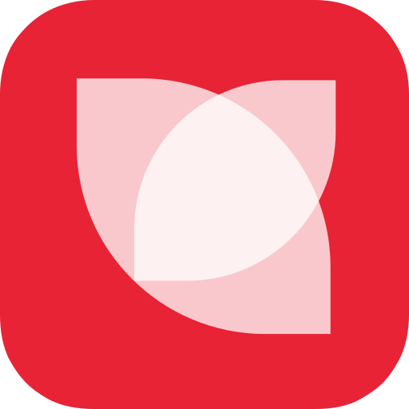

<link rel="stylesheet" type="text/css" href="css/github.css"> 

<h1 align="center"> 
  
</h1> 

## Chinese Internet Equivalency Matrix

Ever wonder?  

## Table of contents:

* [Chinese to Western](#chinese-to-western) 
* [Western to Chinese](#western-to-chinese) 
* [Links](#links) 

## Chinese to Western:
[Table of Contents](#table-of-contents)

| Chinese Icon  | Chinese Name | Wikipedia | Western Icon | Western Name      | Description  |
|:-------------:|:------------:|:---------:|:------------:|:-----------------:|:-------------|
|  | Sina Weibo (新浪微博) | <a href="https://en.wikipedia.org/wiki/Sina_Weibo">Wikipedia</a> | Twitter Icon / Facebook Icon | Twitter + Facebook | micro-blogging platform (there are many weibo's, as it is a general term for microblogging) |
|  | Tencent Weibo (腾讯微博) | <a href="https://en.wikipedia.org/wiki/Tencent_Weibo">Wikipedia</a> | Twitter Icon | Twitter | micro-blogging platform (there are many weibo's, as it is a general term for microblogging) |
|  | Renren Wang or Renren Network (人人网) | <a href="https://en.wikipedia.org/wiki/RenRen">Wikipedia</a> | Facebook Icon | Facebook | social networking service |
|  | Tencent QQ (腾讯QQ) | <a href="https://en.wikipedia.org/wiki/Tencent_QQ">Wikipedia</a> | ? | ? | instant messaging app and web portal |
|  | Tencent Q Zone (QQ空间) | <a href="https://en.wikipedia.org/wiki/Qzone">Wikipedia</a> | ? | ? | personal blog for QQ |
|  | Tencent WeChat (微信) | <a href="https://en.wikipedia.org/wiki/WeChat">Wikipedia</a> | ? | ? | instant messaging, social media, mobile payment app |
|  | Tencent Pengyou (腾讯朋友) | <a href="https://en.wikipedia.org/wiki/Pengyou">Wikipedia</a> | Tagged Icon | Tagged | social discovery and networking |
|  | Baidu (百 度) | <a href="https://en.wikipedia.org/wiki/Baidu">Wikipedia</a> | Google Icon | Google | search engine, Cloud computing, AI |
|  | Baidu Tieba (百度贴吧) | <a href="https://en.wikipedia.org/wiki/Baidu_Tieba">Wikipedia</a> | ? | ? | keyword-based discussion forum |
|  | Douban (豆瓣) | <a href="https://en.wikipedia.org/wiki/Douban">Wikipedia</a> | Reddit icon | Reddit | social networking, online music/video/book review database |
|  | Diandian (点点) | None | ? | ? | light blog social community |
|  | Alibaba Taobao (阿里巴巴 淘寶) | <a href="https://en.wikipedia.org/wiki/Taobao">Wikipedia</a> | ? | ? | online shopping platform |
|  | Alibaba Laiwang (阿里巴巴 来往) | None | ? | ? | instant messaging |
|  | AliWangWang (阿里旺旺) | None | ? | ? | instant messaging for TaoBao marketplace |
|  | Kaixin001 or Kaixinwang (开心网) | <a href="https://en.wikipedia.org/wiki/Kaixin001">Wikipedia</a> | ? | ? | social networking |
|  | Feixin or Fetion (飞信) | <a href="https://en.wikipedia.org/wiki/Fetion">Wikipedia</a> | ? | ? | instant messaging, SMS |
|  | Huaban (花瓣) | None | Pinterest icon | Pinterest | photo sharing social network |
|  | Netease Yixin (怡馨) | None | ? | ? | mobile messaging |
|  | Momo (陌陌) | <a href="https://en.wikipedia.org/wiki/Momo_(software)">Wikipedia</a> | Tinder Icon | Tinder | social search, instant messaging |
|  | Zhihu (知乎) | <a href="https://en.wikipedia.org/wiki/Zhihu">Wikipedia</a> | Quora Icon | Quora | upvoting question and answer site |
|  | Meilishou (Now Mogujie or Mogu (蘑菇街)) | <a href="https://en.wikipedia.org/wiki/Mogujie">Wikipedia</a> | ? | ? | social media and e-commerce specializing in fashion |

## Chinese to Western:
[Table of Contents](#table-of-contents)

| Chinese Icon  | Chinese Name | Wikipedia | Western Icon | Western Name      | Description  |
|:-------------:|:------------:|:---------:|:------------:|:-----------------:|:-------------|

## Links:
[Table of Contents](#table-of-contents)

| Icon | Main Site | Download |Sign-up | Login | Other Reference |
|:----:|:---------:|:--------:|:------:|:-----:|:----------------|

