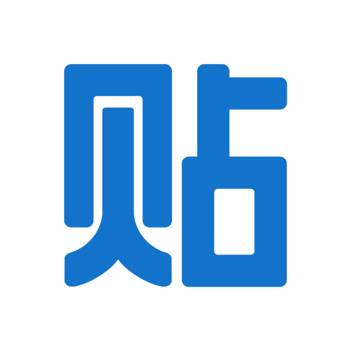

<link rel="stylesheet" type="text/css" href="css/github.css"> 

<h1 align="center"> 
  
</h1> 

## Chinese Internet Equivalency Matrix

Ever wonder?  

## Table of contents:

* [Things to Know](#things-to-know) 
* [Chinese to Western](#chinese-to-western) 
* [Western to Chinese](#western-to-chinese) 
* [Links](#links) 

## Things to Know:
[Table of Contents](#table-of-contents)

The Chinese Internet is a giant mixture of stolen and evolving technology.  The companies who show the most favor and cooperation with 
the CCP win, in the end.  So, some come and go and get swallowed up by the more government-favored giants, a little like in capitalist 
countries, but not really.  This makes any comprehensive list a moving target and that is likely why they are not commonly found.

Evolution does occur and that means that some services change from what they were originally intended to be and into an odd mixture of 
services.  So, a one-to-one equivalency is very difficult to achieve.  

Just like anywhere else, logos also change.  So, you may be looking at an older icon for the same service.  Bear that in mind.  e.g., that 
little "fishy" looking thing on QQ is a silouete of a cute little penguin figure (yeah, think Linux... QQ was early on).  I cannot list
every logo ever used and still have a table useful for quick reference.

I have decided to instead provide Wikipedia links as well as main site, signup, login, and download links so that each one can be 
researched on your own.  It has become almost impossible to do much of anything personal (with an account) on many of these platforms, 
anonymously from the West.  Many of them now require a Chinese phone number.  All Chinese phones require full disclosure of all 
PII (Personally Identifiable Information) at time of sale, so that the CCP can track all activity on their network and more easily
squash any dissidence before it can even begin.  So, if you do not have such access, you may not be able to do any more than some general 
tasks.  Do not be fooled by the limited functionality.

*BEWARE!!!* Installing ANY Chinese-made application, no matter from where, is not secure.  ALL Chinese companies are beholdened and loyal
to the CCP, sharing all data with that government.  There are several studies of common Chinese apps showing them bypassing the Google Play 
system, for example, to "download updates" outside of that monitored system.  These come directly from China and typically have a nice little
spy surprise for your device.  Use a separate phone/computer for all Chinese apps/software at all times!

This is a work in progress, and I will do my best to keep it up-to-date and comprehensive.

Enjoy.

## Chinese to Western:
[Table of Contents](#table-of-contents)

| Chinese Icon  | Chinese Name | Wikipedia | Western Icon | Western Name      | Description  |
|:-------------:|:------------:|:---------:|:------------:|:-----------------:|:-------------|
|  | Sina Weibo (新浪微博) | <a href="https://en.wikipedia.org/wiki/Sina_Weibo">Wikipedia</a> | Twitter Icon / Facebook Icon | Twitter + Facebook | micro-blogging platform (there are many weibo's, as it is a general term for microblogging) |
|  | Tencent Weibo (腾讯微博) | <a href="https://en.wikipedia.org/wiki/Tencent_Weibo">Wikipedia</a> | Twitter Icon | Twitter | micro-blogging platform (there are many weibo's, as it is a general term for microblogging) |
|  | Renren Wang or Renren Network (人人网) | <a href="https://en.wikipedia.org/wiki/Renren">Wikipedia</a> | Facebook Icon | Facebook | social networking service |
|  | Tencent QQ (腾讯QQ) | <a href="https://en.wikipedia.org/wiki/Tencent_QQ">Wikipedia</a> | - | - | instant messaging app and web portal |
|  | Tencent Q Zone (QQ空间) | <a href="https://en.wikipedia.org/wiki/Qzone">Wikipedia</a> | - | - | personal blog for QQ |
|  | Tencent WeChat (微信) | <a href="https://en.wikipedia.org/wiki/WeChat">Wikipedia</a> | - | - | instant messaging, social media, mobile payment app |
|  | Tencent Pengyou (腾讯朋友) | <a href="https://en.wikipedia.org/wiki/Pengyou">Wikipedia</a> | Tagged Icon | Tagged | social discovery and networking |
|  | Baidu (百 度) | <a href="https://en.wikipedia.org/wiki/Baidu">Wikipedia</a> | Google Icon | Google | search engine, Cloud computing, AI |
|  | Baidu Tieba (百度贴吧) | <a href="https://en.wikipedia.org/wiki/Baidu_Tieba">Wikipedia</a> | - | - | keyword-based discussion forum |
|  | Douban (豆瓣) | <a href="https://en.wikipedia.org/wiki/Douban">Wikipedia</a> | Reddit icon | Reddit | social networking, online music/video/book review database |
|  | Diandian (点点) | None | - | - | light blog social community |
|  | Alibaba Taobao (阿里巴巴 淘寶) | <a href="https://en.wikipedia.org/wiki/Taobao">Wikipedia</a> | - | - | online shopping platform |
|  | Alibaba Laiwang (阿里巴巴 来往) | None | - | - | instant messaging |
|  | AliWangWang (阿里旺旺) | None | - | - | instant messaging for TaoBao marketplace |
|  | Kaixin001 or Kaixinwang (开心网) | <a href="https://en.wikipedia.org/wiki/Kaixin001">Wikipedia</a> | - | - | social networking |
|  | Feixin or Fetion (飞信) | <a href="https://en.wikipedia.org/wiki/Fetion">Wikipedia</a> | - | - | instant messaging, SMS |
|  | Huaban (花瓣) | None | Pinterest icon | Pinterest | photo sharing social network |
|  | Netease Yixin (怡馨) | None | - | - | mobile messaging |
|  | Momo (陌陌) | <a href="https://en.wikipedia.org/wiki/Momo_(software)">Wikipedia</a> | Tinder Icon | Tinder | social search, instant messaging |
|  | Zhihu (知乎) | <a href="https://en.wikipedia.org/wiki/Zhihu">Wikipedia</a> | Quora Icon | Quora | upvoting question and answer site |
|  | Meilishou (Now Mogujie or Mogu (蘑菇街)) | <a href="https://en.wikipedia.org/wiki/Mogujie">Wikipedia</a> | - | - | social media and e-commerce specializing in fashion |
|  | Yunduan (-) | - | - | - | - |
|  | Netease Weibo (-) | - | - | - | - |
|  | Baidu Search (-) | - | - | - | - |
|  | Xiaomi Miliao (-) | - | - | - | - |

## Western to Chinese:
[Table of Contents](#table-of-contents)

| Western Icon  | Western Name | Wikipedia | Chinese Icon | Chinese Name      | Description  |
|:-------------:|:------------:|:---------:|:------------:|:-----------------:|:-------------|

## Links:
[Table of Contents](#table-of-contents)

| Icon | Service | Main Site | Download | Sign-up | Login | Other Reference |
|:----:|:-------:|:---------:|:--------:|:-------:|:-----:|:----------------|
|  | Sina Weibo (新浪微博) | <a href="https://weibo.com/us">Main</a> | <a href="https://play.google.com/store/apps/details?id=com.sina.weibo&hl=en_US&gl=US">Android</a> <a href="https://apps.apple.com/us/app/weibo/id350962117">Apple</a> | <a href="https://weibo.com/signup/signup.php">Signup</a> | <a href="https://weibo.com/login.php">Login</a> | <a href="notyet">-</a> |
|  | Tencent Weibo (腾讯微博) | <a href="http://t.qq.com/">Main</a> | No longer available | No longer available | No longer available | <a href="https://kr-asia.com/tencent-finally-kills-microblogging-service-tencent-weibo-after-years-long-decline">Tencent shuts down Weibo</a> |
|  | Renren Wang or Renren Network (人人网) | <a href="notyet">-</a> | <a href="notyet">-</a> | <a href="notyet">-</a> | <a href="https://renren.com/login">Login</a> | <a href="notyet">-</a> |
|  | Tencent QQ (腾讯QQ) | <a href="https://www.qq.com/">Main</a> | <a href="notyet">-</a> | <a href="https://ssl.zc.qq.com/v3/index-en.html">Signup</a> | <a href="https://qzone.qq.com/">Login</a> | <a href="notyet">-</a> |
|  | Tencent Q Zone (QQ空间) | <a href="https://qzone.qq.com/">Main</a> | <a href="notyet">-</a> | <a href="https://ssl.zc.qq.com/v3/index-en.html">Signup</a> | <a href="https://qzone.qq.com/">Login</a> | <a href="notyet">-</a> |
|  | Tencent WeChat (微信) | <a href="notyet">-</a> | <a href="notyet">-</a> | <a href="notyet">-</a> | <a href="notyet">-</a> | <a href="notyet">-</a> |
|  | Tencent Pengyou (腾讯朋友) | <a href="notyet">-</a> | <a href="notyet">-</a> | <a href="notyet">-</a> | <a href="notyet">-</a> | <a href="notyet">-</a> |
|  | Baidu (百 度) | <a href="notyet">-</a> | <a href="notyet">-</a> | <a href="notyet">-</a> | <a href="notyet">-</a> | <a href="notyet">-</a> |
|  | Baidu Tieba (百度贴吧) | <a href="notyet">-</a> | <a href="notyet">-</a> | <a href="notyet">-</a> | <a href="notyet">-</a> | <a href="notyet">-</a> |
|  | Douban (豆瓣) | <a href="notyet">-</a> | <a href="notyet">-</a> | <a href="notyet">-</a> | <a href="notyet">-</a> | <a href="notyet">-</a> |
|  | Diandian (点点) | <a href="notyet">-</a> | <a href="notyet">-</a> | <a href="notyet">-</a> | <a href="notyet">-</a> | <a href="notyet">-</a> |
|  | Alibaba Taobao (阿里巴巴 淘寶) | <a href="notyet">-</a> | <a href="notyet">-</a> | <a href="notyet">-</a> | <a href="notyet">-</a> | <a href="notyet">-</a> |
|  | Alibaba Laiwang (阿里巴巴 来往) | <a href="notyet">-</a> | <a href="notyet">-</a> | <a href="notyet">-</a> | <a href="notyet">-</a> | <a href="notyet">-</a> |
|  | AliWangWang (阿里旺旺) | <a href="notyet">-</a> | <a href="notyet">-</a> | <a href="notyet">-</a> | <a href="notyet">-</a> | <a href="notyet">-</a> |
|  | Kaixin001 or Kaixinwang (开心网) | <a href="https://www.kaixin001.com/">Main</a> | <a href="notyet">-</a> | <a href="notyet">-</a> | <a href="notyet">-</a> | <a href="notyet">-</a> |
|  | Feixin or Fetion (飞信) | <a href="notyet">-</a> | <a href="notyet">-</a> | <a href="notyet">-</a> | <a href="notyet">-</a> | <a href="notyet">-</a> |
|  | Huaban (花瓣) | <a href="notyet">-</a> | <a href="notyet">-</a> | <a href="notyet">-</a> | <a href="notyet">-</a> | <a href="notyet">-</a> |
|  | Netease Yixin (怡馨) | <a href="notyet">-</a> | <a href="notyet">-</a> | <a href="notyet">-</a> | <a href="notyet">-</a> | <a href="notyet">-</a> |
|  | Momo (陌陌) | <a href="notyet">-</a> | <a href="notyet">-</a> | <a href="notyet">-</a> | <a href="notyet">-</a> | <a href="notyet">-</a> |
|  | Zhihu (知乎) | <a href="notyet">-</a> | <a href="notyet">-</a> | <a href="notyet">-</a> | <a href="notyet">-</a> | <a href="notyet">-</a> |
|  | Meilishou (Now Mogujie or Mogu (蘑菇街)) | <a href="notyet">-</a> | <a href="notyet">-</a> | <a href="notyet">-</a> | <a href="notyet">-</a> | <a href="notyet">-</a> |
|  | Yunduan (-) | <a href="notyet">-</a> | <a href="notyet">-</a> | <a href="notyet">-</a> | <a href="notyet">-</a> | <a href="notyet">-</a> |
|  | Netease Weibo (-) | <a href="notyet">-</a> | <a href="notyet">-</a> | <a href="notyet">-</a> | <a href="notyet">-</a> | <a href="notyet">-</a> |
|  | Baidu Search (-) | <a href="notyet">-</a> | <a href="notyet">-</a> | <a href="notyet">-</a> | <a href="notyet">-</a> | <a href="notyet">-</a> |
|  | Xiaomi Miliao (-) | <a href="notyet">-</a> | <a href="notyet">-</a> | <a href="notyet">-</a> | <a href="notyet">-</a> | <a href="notyet">-</a> |

